# AI驱动测试任务管理系统 - 产品文档

## 文档版本

| 版本 | 日期 | 修订说明 | 作者 |
|-----|------|---------|------|
| v1.0 | 2024-12-17 | 初始版本 | SynapseTest Team |

---

## 目录

- [1. 产品概述](#1-产品概述)
- [2. 产品功能](#2-产品功能)
- [3. 核心功能详解](#3-核心功能详解)
- [4. 用户角色与权限](#4-用户角色与权限)
- [5. 业务流程](#5-业务流程)
- [6. 产品特色](#6-产品特色)
- [7. 应用场景](#7-应用场景)
- [8. 产品价值](#8-产品价值)

---

## 1. 产品概述

### 1.1 产品定位

**SynapseTest** 是一款面向中大型企业研发团队的AI驱动测试任务管理平台。通过智能化调度和全流程优化，为多版本、多场景测试需求提供高效、可靠的自动化测试解决方案。

### 1.2 核心价值

#### 效率跃升
- ✅ **AI智能生成**：自动生成测试用例，减少75%的用例编写时间
- ✅ **智能去重**：基于语义相似度自动识别重复用例，降低40%执行冗余
- ✅ **智能推荐**：基于代码变更和历史数据，智能推荐测试策略

#### 智能决策
- ✅ **风险预测**：分析代码变更，预测潜在风险区域
- ✅ **策略推荐**：根据任务上下文，推荐最优测试范围和优先级
- ✅ **优先级排序**：多因子智能评分，确保关键用例优先执行

#### 质量保障
- ✅ **实时监控**：测试执行过程的实时监控和追踪
- ✅ **质量分析**：全方位的测试用例质量分析和报告
- ✅ **端到端追溯**：测试用例与需求、缺陷的完整关联

### 1.3 目标用户

| 用户角色 | 核心诉求 | 使用场景 |
|---------|---------|---------|
| **测试工程师** | 提高用例设计和执行效率，减少重复劳动 | 用例生成、任务执行、结果分析 |
| **开发工程师** | 快速获取测试反馈，确保代码质量 | 查看测试报告，关联缺陷修复 |
| **测试经理** | 优化资源分配，把控质量趋势 | 策略制定、进度监控、报告生成 |
| **发布经理** | 确保版本发布前的测试覆盖全面 | 风险预测、质量报告、发布决策 |
| **DevOps工程师** | 集成自动化流水线，提升系统稳定性 | 平台维护、CI/CD集成 |

---

## 2. 产品功能

### 2.1 功能模块图

```
┌─────────────────────────────────────────────────────────────┐
│                    AI驱动测试任务管理系统                      │
└─────────────────────────────────────────────────────────────┘
                              │
        ┌─────────────────────┼─────────────────────┐
        │                     │                     │
   ┌────▼────┐          ┌────▼────┐          ┌────▼────┐
   │ 工作台   │          │ 用例管理 │          │ 任务管理 │
   └────┬────┘          └────┬────┘          └────┬────┘
        │                    │                     │
   ┌────▼────┐          ┌────▼────┐          ┌────▼────┐
   │ 概览统计 │          │ 智能生成 │          │ 创建任务 │
   │ 快捷入口 │          │ 批量生成 │          │ 任务列表 │
   │ 待办事项 │          │ 生成历史 │          │ 执行跟踪 │
   └─────────┘          │ 用例列表 │          └─────────┘
                        │ 用例优化 │
                        └────┬────┘
                             │
                   ┌─────────┼─────────┐
                   │         │         │
              ┌────▼────┐ ┌─▼──┐ ┌───▼────┐
              │ 智能推荐 │ │去重 │ │优先级  │
              │ 质量分析 │ └────┘ │排序    │
              └─────────┘         └────────┘
                             │
        ┌─────────────────────┼─────────────────────┐
        │                     │                     │
   ┌────▼────┐          ┌────▼────┐          ┌────▼────┐
   │ 监控分析 │          │ 配置管理 │          │ 智能推荐 │
   └────┬────┘          └────┬────┘          └────┬────┘
        │                    │                     │
   ┌────▼────┐          ┌────▼────┐          ┌────▼────┐
   │ 实时监控 │          │ 测试版本 │          │ 策略推荐 │
   │ 质量报告 │          │ 测试环境 │          └─────────┘
   └─────────┘          └─────────┘
```

### 2.2 功能列表

#### ✅ 已实现功能

| 功能模块 | 子功能 | 功能描述 | AI能力 |
|---------|-------|---------|--------|
| **工作台** | 概览统计 | 测试数据概览、快捷入口、待办事项 | - |
| **用例生成** | 智能生成 | 基于需求文档AI生成测试用例 | ✅ RAG + LLM |
| | 批量生成 | 批量上传需求文档生成用例 | ✅ RAG + LLM |
| | 生成历史 | 查看历史生成记录和结果 | - |
| **智能推荐** | 策略推荐 | 基于代码变更推荐测试策略 | ✅ XGBoost + 规则引擎 |
| **用例管理** | 用例列表 | 查看、搜索、筛选测试用例 | - |
| | 用例优化 | 智能去重、优先级排序、质量分析 | ✅ Sentence-BERT + 多因子评分 |
| **测试任务** | 创建任务 | 创建测试任务，关联用例 | - |
| | 任务列表 | 查看和管理测试任务 | - |
| | 执行跟踪 | 实时跟踪任务执行状态 | - |
| **监控分析** | 实时监控 | 测试执行的实时监控 | - |
| | 质量报告 | 测试质量分析报告 | ✅ AI质量评估 |
| **配置管理** | 测试版本 | 管理测试版本 | - |
| | 测试环境 | 管理测试环境 | - |

---

## 3. 核心功能详解

### 3.1 工作台

#### 功能描述
工作台是用户登录后的首页，提供系统整体概览和快捷操作入口。

#### 主要功能
- **数据概览**：展示测试用例总数、任务执行情况、成功率等关键指标
- **快捷入口**：快速访问常用功能（智能生成、创建任务、查看报告等）
- **待办事项**：显示待处理的测试任务和优化建议
- **趋势图表**：测试活动趋势、用例增长曲线等可视化图表

#### 使用场景
- 测试经理每日查看团队测试情况
- 测试工程师快速进入常用功能
- 管理层了解整体测试质量趋势

#### 界面截图

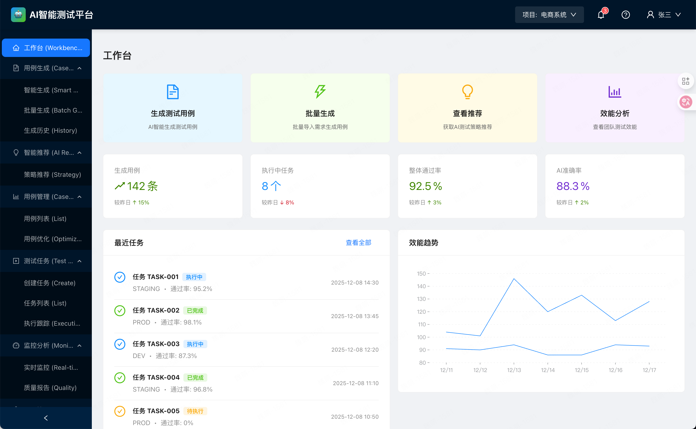

---

### 3.2 用例生成

#### 3.2.1 智能生成

**功能描述**：基于需求文档，利用AI技术自动生成结构化测试用例。

**AI核心能力**：
- 🤖 **RAG检索增强生成**：检索历史相似用例作为参考
- 🤖 **LLM智能生成**：使用大语言模型生成高质量用例
- 🤖 **智能解析**：自动解析需求文档，提取关键信息

**使用流程**：
1. 输入需求文档（文本、Markdown、Word等）
2. 选择模块/功能分类
3. 设置生成参数（用例数量、是否包含边界用例等）
4. AI自动生成测试用例
5. 人工审核和调整
6. 保存到用例库

**生成结果包含**：
- ✅ 用例标题（中文）
- ✅ 测试步骤（详细的操作步骤）
- ✅ 预期结果
- ✅ 优先级（P0-P3）
- ✅ 测试类型（功能/性能/安全等）
- ✅ 前置条件
- ✅ 标签

**优势**：
- 减少75%的用例编写时间
- 自动考虑边界条件和异常场景
- 基于企业历史数据生成符合规范的用例

#### 界面截图

**智能生成界面**：

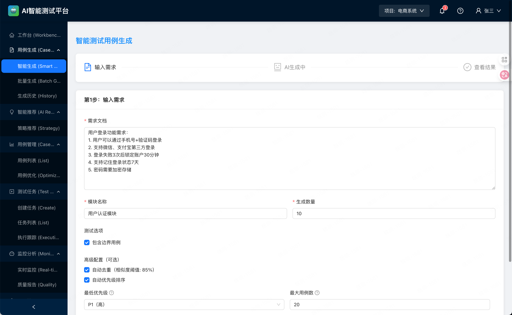

**生成过程**：

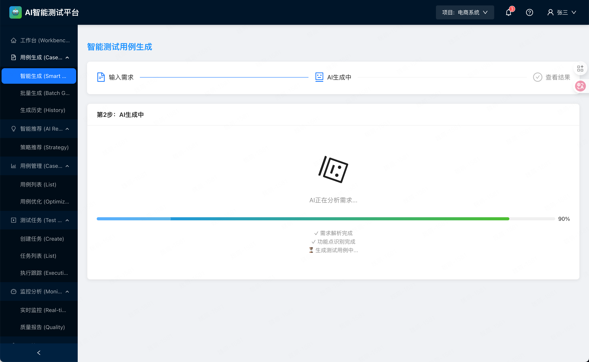

**生成结果**：

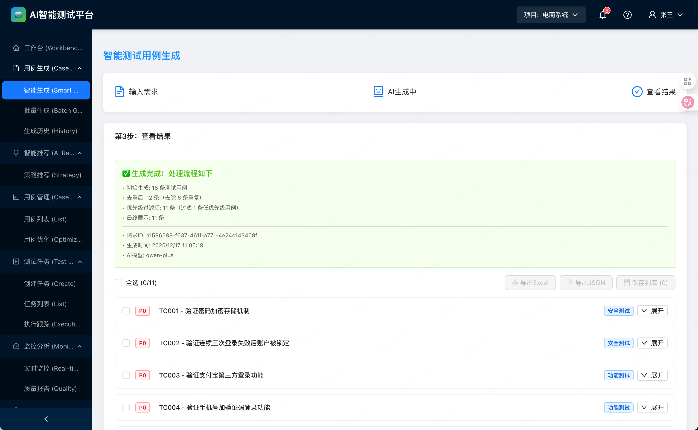

#### 3.2.2 批量生成

**功能描述**：支持批量上传多个需求文档，一次性生成大量测试用例。

**适用场景**：
- 新项目启动，需要快速建立用例库
- 版本迭代，多个需求同时开发
- 历史需求补充测试用例

**批量生成流程**：
1. 上传多个需求文档（支持ZIP压缩包）
2. 系统自动识别文档类型和模块
3. 并发调用AI生成引擎
4. 展示批量生成进度
5. 汇总生成结果
6. 批量审核和导入

#### 3.2.3 生成历史

**功能描述**：记录所有用例生成活动，支持查询和追溯。

**包含信息**：
- 生成时间和操作人
- 输入的需求文档
- 生成的用例数量
- 生成质量评分
- AI模型版本
- 是否已导入用例库

**价值**：
- 可追溯性：了解用例的来源
- 质量分析：评估AI生成效果
- 知识沉淀：积累企业测试知识库

---

### 3.3 智能推荐

#### 3.3.1 策略推荐

**功能描述**：基于代码变更、历史数据和业务上下文，智能推荐最优测试策略。

**AI核心能力**：
- 🤖 **风险预测**：分析代码变更，预测高风险区域
- 🤖 **策略推荐**：XGBoost模型 + 规则引擎推荐测试范围
- 🤖 **环境推荐**：根据变更类型推荐测试环境

**输入信息**：
- 代码变更（修改的模块、文件数、代码行数）
- 变更类型（新功能/Bug修复/重构/Hotfix）
- 历史测试数据
- 环境和版本信息

**推荐结果**：
```json
{
  "test_scope": "FULL",        // 测试范围：SMOKE/REGRESSION/FULL
  "priority": 9,               // 优先级：1-10
  "environment": "STAGING",    // 推荐环境
  "estimated_duration": "2h",  // 预估时长
  "confidence": 0.92,          // 置信度
  "risk_assessment": {
    "risk_level": "HIGH",      // 风险等级
    "risk_factors": [          // 风险因素
      "核心模块变更",
      "影响支付流程",
      "数据库schema变更"
    ],
    "suggestions": [           // 建议
      "建议全量回归测试",
      "重点关注支付模块",
      "进行数据一致性检查"
    ]
  },
  "reasoning": "..."           // 推荐理由
}
```

**业务规则**：
- 关键模块（支付、认证、核心业务）→ 强制全量测试
- Hotfix → 最高优先级 + Staging环境
- 大规模变更（>20文件或>500行）→ 全量+压力测试

**使用场景**：
- 创建测试任务时，获取AI推荐的测试策略
- 评审会议上，基于数据做测试决策
- CI/CD流程中，自动触发合适的测试范围

#### 界面截图

**策略推荐界面**：

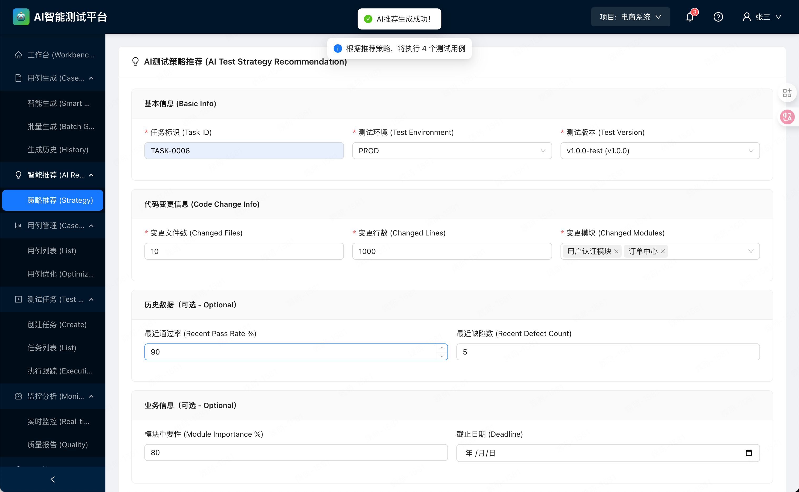

**推荐详情**：

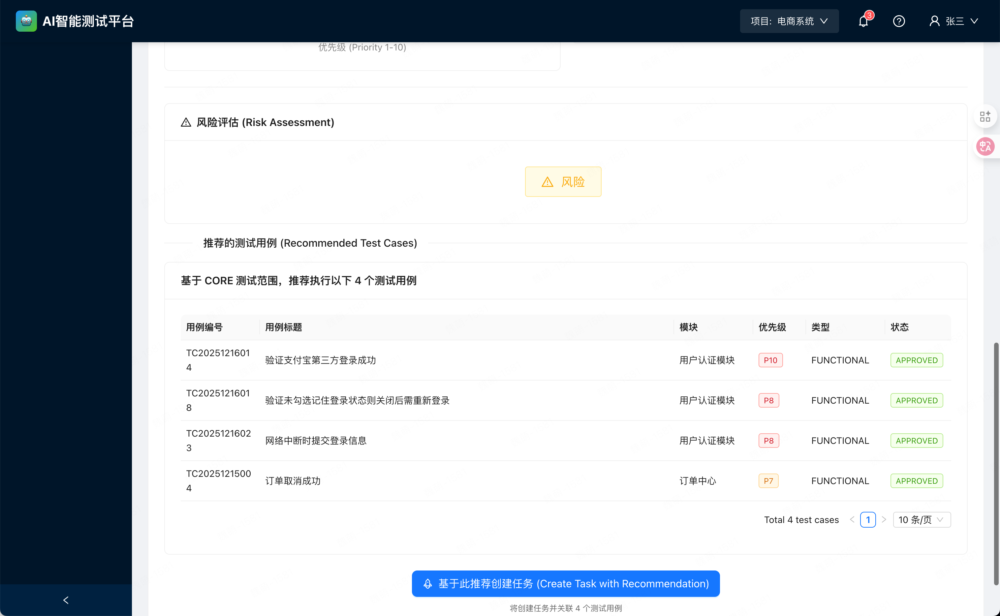

---

### 3.4 用例管理

#### 3.4.1 用例列表

**功能描述**：集中管理所有测试用例，支持多维度查询和筛选。

**主要功能**：
- **列表展示**：表格形式展示用例信息
- **搜索**：按关键字搜索用例标题和内容
- **筛选**：按模块、优先级、类型、状态筛选
- **排序**：按创建时间、优先级、执行次数排序
- **批量操作**：批量导出、删除、标记

**用例详情**：
- 基本信息：标题、描述、优先级、类型
- 执行信息：执行次数、成功率、最后执行时间
- 关联信息：关联需求、关联缺陷、创建人
- 优化建议：AI给出的优化建议

#### 界面截图

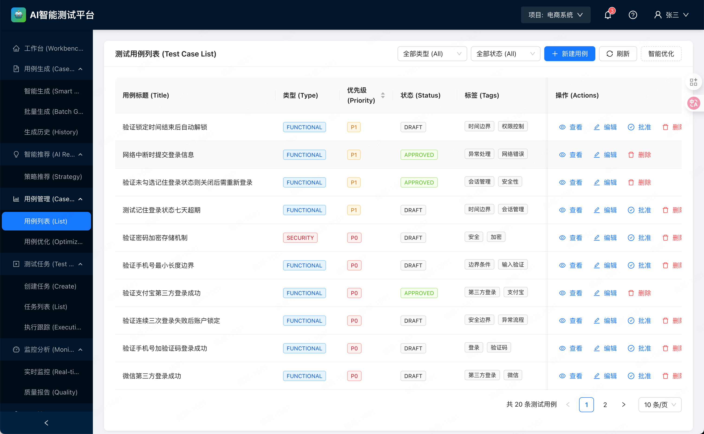

#### 3.4.2 用例优化

**功能描述**：提供智能去重、优先级排序、质量分析三大AI优化功能。

##### 🤖 智能去重

**原理**：使用Sentence-BERT模型计算测试用例的语义相似度，识别重复用例。

**技术方案**：
- **模型**：`paraphrase-multilingual-mpnet-base-v2` (多语言Sentence-BERT)
- **相似度阈值**：0.85（可调）
- **算法**：余弦相似度 + 聚类

**去重流程**：
1. 提取用例文本特征（标题 + 步骤描述）
2. 使用Sentence-BERT生成embedding向量
3. 计算向量间的余弦相似度
4. 相似度 > 阈值的用例标记为重复组
5. 从每组中选择最优用例作为代表

**最优用例选择标准**：
- 步骤完整性（步骤数量多）
- 描述详细程度（文本长度、结构化程度）
- 优先级高（P0/P1）
- 执行历史丰富

**展示结果**：
```json
{
  "total_cases": 50,
  "unique_cases": 42,
  "duplicate_groups": [
    {
      "group_id": 1,
      "representative": {
        "case_id": "TC001",
        "title": "用户登录-正常流程",
        "similarity_score": 1.0
      },
      "duplicates": [
        {
          "case_id": "TC025",
          "title": "测试用户登录功能",
          "similarity_score": 0.89
        },
        {
          "case_id": "TC037",
          "title": "用户正常登录测试",
          "similarity_score": 0.87
        }
      ]
    }
  ]
}
```

**用户操作**：
- 查看重复组详情
- 对比重复用例的差异
- 选择保留或删除
- 合并用例内容

**界面截图**：

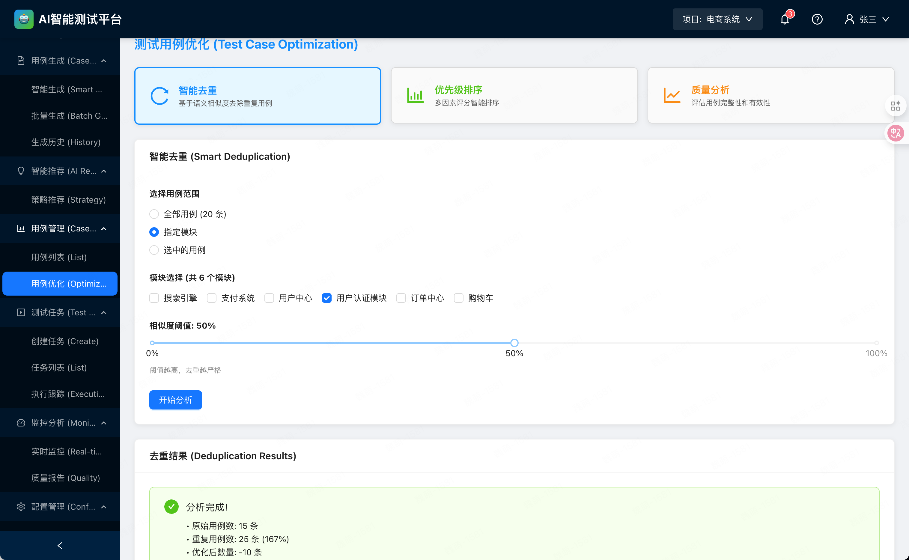

##### 🤖 优先级排序

**原理**：基于多因子加权评分模型，智能计算用例的优先级分数。

**评分因子**：
| 因子 | 权重 | 说明 |
|-----|------|-----|
| **业务价值** | 30% | 覆盖核心功能、高频场景 |
| **风险等级** | 25% | 历史缺陷密度、变更频率 |
| **执行成本** | 20% | 步骤复杂度、执行时间 |
| **失败历史** | 15% | 历史失败率、稳定性 |
| **覆盖影响** | 10% | 代码覆盖贡献度 |

**计算公式**：
```
优先级分数 = Σ(因子值 × 权重)
```

**排序逻辑**：
1. 计算每个用例的五个因子值（0-1归一化）
2. 加权求和得到总分
3. 按总分降序排列
4. 附加详细评分分解

**结果展示**：
```json
{
  "case_id": "TC001",
  "title": "用户登录-正常流程",
  "priority_score": 0.85,
  "rank": 1,
  "score_breakdown": {
    "business_value": 0.90,
    "risk_level": 0.85,
    "execution_cost": 0.80,
    "failure_history": 0.75,
    "coverage_impact": 0.95
  }
}
```

**应用场景**：
- 时间紧张时，优先执行高分用例
- 制定测试计划，合理分配资源
- 持续集成中，动态调整执行顺序

**界面截图**：

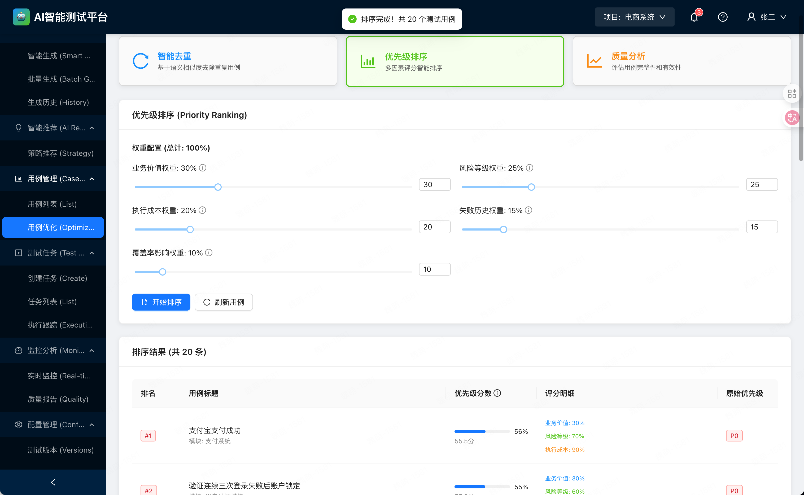

##### 🤖 质量分析

**功能描述**：对测试用例集进行全面质量分析，给出改进建议。

**分析维度**：
1. **完整性分析**
   - 必填字段完整率
   - 步骤详细程度
   - 预期结果明确性

2. **覆盖度分析**
   - 功能点覆盖率
   - 场景覆盖率（正常/异常/边界）
   - 测试类型分布

3. **优先级分布**
   - P0/P1/P2/P3用例数量
   - 是否符合2-3-3-2分布原则

4. **复杂度分析**
   - 平均步骤数
   - 复杂用例占比
   - 自动化友好度

5. **AI质量评分**
   - 描述清晰度（NLP分析）
   - 结构规范性
   - 可执行性

**分析报告**：
```json
{
  "total_cases": 150,
  "quality_grade": "B+",           // 质量等级：A+/A/B+/B/C
  "completeness_score": 0.85,      // 完整性得分
  "priority_distribution": {
    "P0": 20,
    "P1": 45,
    "P2": 60,
    "P3": 25
  },
  "type_distribution": {
    "功能测试": 100,
    "性能测试": 20,
    "安全测试": 15,
    "兼容性测试": 15
  },
  "average_steps_per_case": 5.2,
  "issues_found": [
    {
      "type": "缺少边界用例",
      "severity": "medium",
      "affected_modules": ["登录", "支付"],
      "suggestion": "建议补充边界和异常场景用例"
    },
    {
      "type": "P0用例过少",
      "severity": "high",
      "suggestion": "核心功能应增加更多P0用例"
    }
  ],
  "recommendations": [
    "建议补充性能测试用例",
    "部分用例步骤过于简单，需细化",
    "建议对支付模块增加安全测试覆盖"
  ]
}
```

**界面截图**：

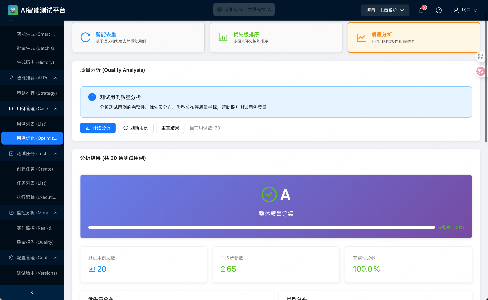

---

### 3.5 测试任务

#### 3.5.1 创建任务

**功能描述**：创建测试任务，关联测试用例和执行计划。

**创建流程**：
1. **基本信息**
   - 任务名称
   - 任务描述
   - 负责人

2. **选择用例**
   - 从用例库选择
   - 支持批量选择
   - 可基于AI推荐选择

3. **配置参数**
   - 测试版本
   - 测试环境
   - 执行时间

4. **AI辅助**
   - 获取测试策略推荐
   - 自动推荐相关用例
   - 预估执行时间

**界面截图**：

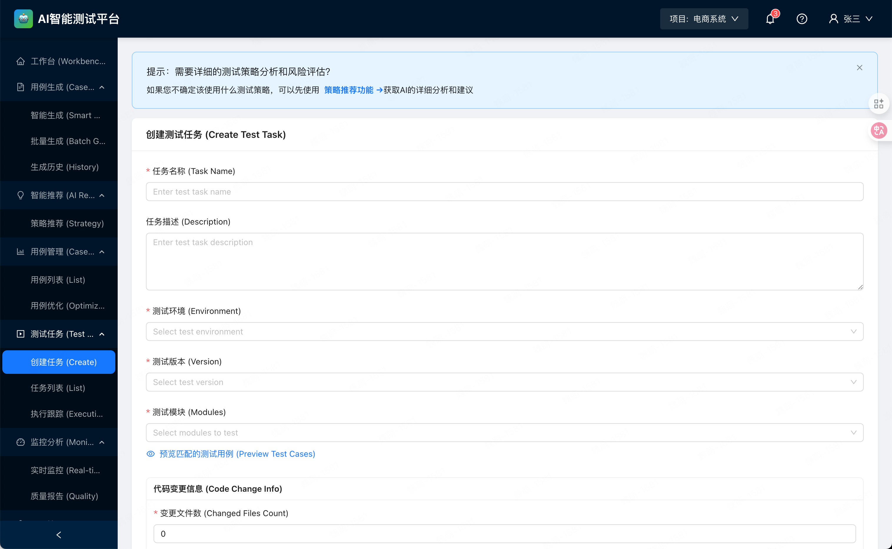

#### 3.5.2 任务列表

**功能描述**：展示所有测试任务，支持状态跟踪和管理。

**任务状态**：
- 待执行
- 执行中
- 已完成
- 已取消

**列表功能**：
- 查看任务详情
- 开始/暂停/取消任务
- 查看执行进度
- 导出测试报告

**界面截图**：

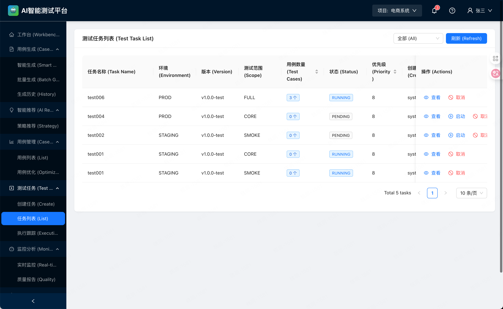

#### 3.5.3 执行跟踪

**功能描述**：实时跟踪测试任务的执行情况。

**跟踪信息**：
- 总用例数 vs 已执行用例数
- 通过率
- 失败用例详情
- 执行时间统计
- 实时日志

**可视化展示**：
- 执行进度条
- 通过率饼图
- 执行趋势折线图

**界面截图**：

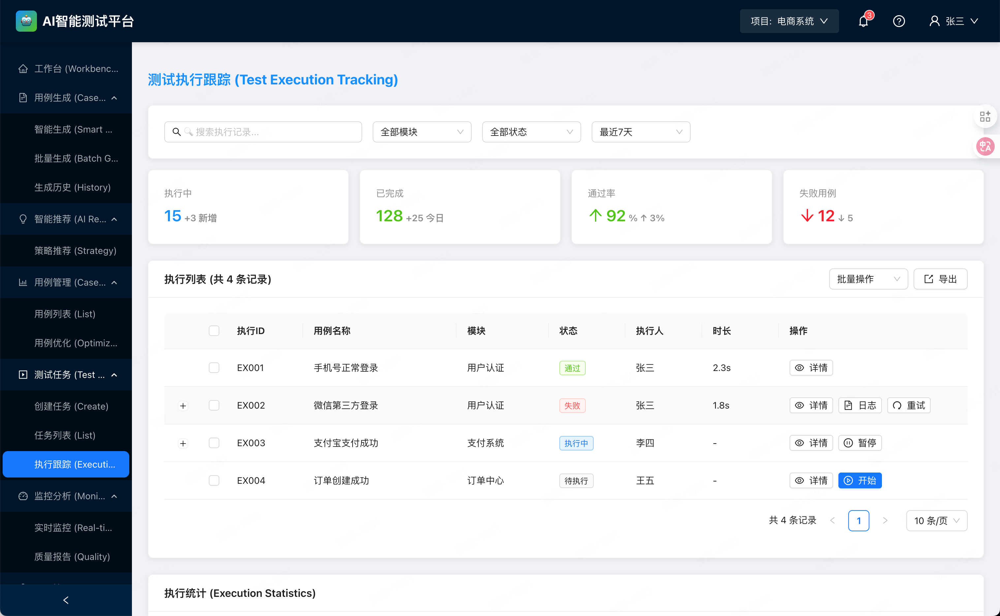

---

### 3.6 监控分析

#### 3.6.1 实时监控

**功能描述**：实时监控测试执行过程，及时发现问题。

**监控内容**：
- 执行中的任务数
- 实时通过率
- 失败用例实时告警
- 资源使用情况

#### 3.6.2 质量报告

**功能描述**：生成测试质量分析报告，支持多维度数据分析。

**报告内容**：
1. **测试执行概览**
   - 总用例数、执行数、通过数、失败数
   - 整体通过率
   - 执行趋势图

2. **质量分析**
   - 模块质量分布
   - 缺陷密度
   - 测试覆盖率

3. **AI分析**
   - 失败原因智能分类
   - 质量趋势预测
   - 改进建议

4. **对比分析**
   - 与上一版本对比
   - 与历史平均水平对比

---

### 3.7 配置管理

#### 3.7.1 测试版本

**功能描述**：管理测试的版本信息。

**版本信息**：
- 版本号
- 版本描述
- 发布时间
- 相关需求
- 测试状态

**操作**：
- 新增版本
- 编辑版本
- 查看版本测试历史

**界面截图**：

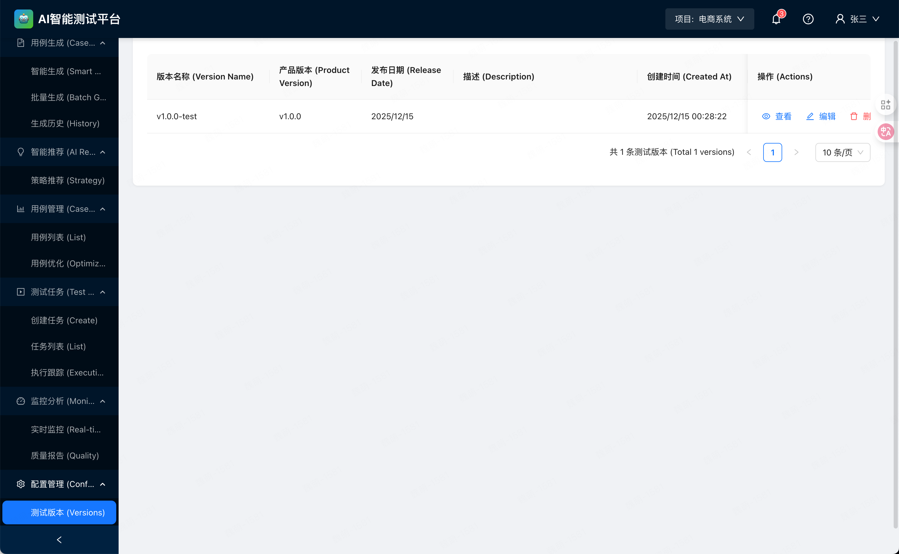

#### 3.7.2 测试环境

**功能描述**：管理测试环境配置。

**环境类型**：
- 开发环境（DEV）
- 测试环境（TEST）
- 预发布环境（STAGING）
- 生产环境（PROD）

**环境信息**：
- 环境名称
- 环境地址
- 数据库配置
- 环境状态

**界面截图**：

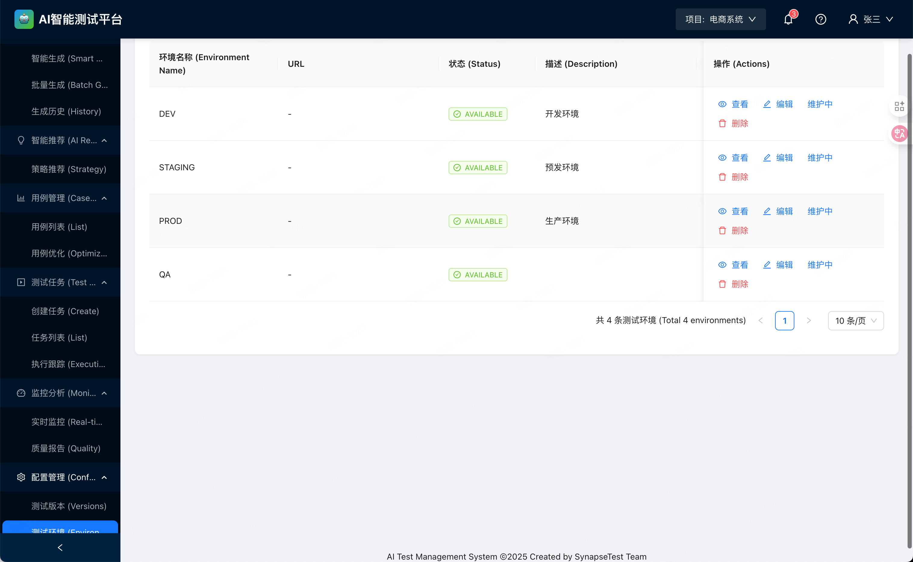

---

## 4. 用户角色与权限

### 4.1 角色定义

| 角色 | 权限范围 | 主要职责 |
|-----|---------|---------|
| **系统管理员** | 全部权限 | 系统配置、用户管理、数据维护 |
| **测试经理** | 管理级权限 | 策略制定、团队管理、报告审核 |
| **测试工程师** | 执行级权限 | 用例创建、任务执行、结果分析 |
| **开发工程师** | 只读权限 | 查看测试报告、关联缺陷 |
| **访客** | 受限只读权限 | 查看公开报告 |

### 4.2 权限矩阵

| 功能 | 系统管理员 | 测试经理 | 测试工程师 | 开发工程师 | 访客 |
|-----|----------|---------|-----------|-----------|-----|
| 用例生成 | ✅ | ✅ | ✅ | ❌ | ❌ |
| 用例编辑 | ✅ | ✅ | ✅ | ❌ | ❌ |
| 用例查看 | ✅ | ✅ | ✅ | ✅ | ✅ |
| 创建任务 | ✅ | ✅ | ✅ | ❌ | ❌ |
| 执行任务 | ✅ | ✅ | ✅ | ❌ | ❌ |
| 查看报告 | ✅ | ✅ | ✅ | ✅ | ✅ |
| 配置管理 | ✅ | ✅ | ❌ | ❌ | ❌ |
| 用户管理 | ✅ | ❌ | ❌ | ❌ | ❌ |

---

## 5. 业务流程

### 5.1 智能生成测试用例流程

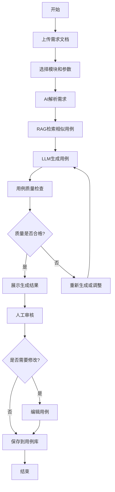

### 5.2 测试任务执行流程

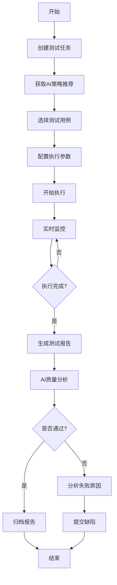

### 5.3 用例优化流程

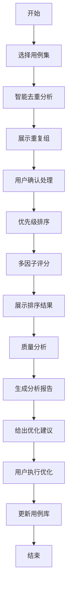

---

## 6. 产品特色

### 6.1 AI驱动的核心优势

#### 1. 智能生成 - 解放生产力
- **RAG增强**：基于历史数据生成更符合企业规范的用例
- **高质量输出**：自动生成完整的测试步骤和预期结果
- **快速迭代**：75%的时间节省，快速响应需求变更

#### 2. 智能推荐 - 精准决策
- **风险预测**：提前识别高风险区域
- **策略推荐**：数据驱动的测试范围决策
- **环境优化**：智能推荐最适合的测试环境

#### 3. 智能优化 - 持续改进
- **语义去重**：不只是文本匹配，理解用例真实意图
- **智能排序**：多维度评分，确保关键用例优先执行
- **质量分析**：AI评估用例质量，给出改进方向

### 6.2 技术特色

#### 1. 先进的AI技术栈
- **大语言模型**：支持Qwen、DeepSeek等主流模型
- **向量数据库**：Qdrant/Milvus高效语义检索
- **机器学习**：XGBoost、Sentence-BERT等成熟算法

#### 2. 灵活的架构设计
- **微服务架构**：前后端分离，AI服务独立部署
- **可扩展**：支持多种向量数据库和LLM提供商
- **高性能**：Redis缓存、异步处理

#### 3. 完善的工程实践
- **容器化部署**：Docker + Docker Compose
- **可观测性**：日志、监控、追踪
- **测试覆盖**：单元测试、集成测试

---

## 7. 应用场景

### 7.1 场景1：新项目测试用例快速建立

**背景**：新项目启动，需要在短时间内建立完整的测试用例库。

**解决方案**：
1. 批量上传需求文档（PRD、用户故事）
2. AI批量生成测试用例
3. 智能去重和质量分析
4. 人工审核后导入用例库

**效果**：
- 1周内完成300+用例的建立（传统方式需要1个月）
- 用例质量评分达到B+以上
- 覆盖率达到85%+

### 7.2 场景2：版本迭代回归测试

**背景**：版本迭代频繁，需要快速确定回归测试范围。

**解决方案**：
1. 输入代码变更信息
2. AI分析风险并推荐测试策略
3. 基于推荐结果创建测试任务
4. 智能排序确保关键用例优先执行

**效果**：
- 测试范围决策时间从2小时缩短到10分钟
- 通过风险预测，提前发现80%的缺陷
- 测试效率提升40%

### 7.3 场景3：测试用例优化

**背景**：用例库经过多次迭代，存在大量重复和低质量用例。

**解决方案**：
1. 使用智能去重功能识别重复用例
2. 使用优先级排序功能评估用例价值
3. 使用质量分析功能发现问题
4. 基于AI建议进行优化

**效果**：
- 识别并清理40%的重复用例
- 用例执行时间减少30%
- 用例质量从C提升到B+

### 7.4 场景4：持续集成自动化

**背景**：CI/CD流水线需要集成自动化测试。

**解决方案**：
1. 通过API集成到Jenkins/GitLab CI
2. 代码提交后自动获取AI推荐的测试策略
3. 自动创建测试任务并执行
4. 执行完成后自动生成报告

**效果**：
- 实现测试全自动化
- 反馈时间从4小时缩短到30分钟
- 提升开发团队交付效率

---

## 8. 产品价值

### 8.1 量化价值

| 指标 | 传统方式 | 使用SynapseTest | 提升 |
|-----|---------|----------------|------|
| **用例编写时间** | 4小时/10用例 | 1小时/10用例 | 75% ↑ |
| **重复用例占比** | 40% | 5% | 87.5% ↓ |
| **测试策略决策时间** | 2小时 | 10分钟 | 91.7% ↓ |
| **缺陷发现率** | 60% | 85% | 41.7% ↑ |
| **测试执行效率** | 基准 | +40% | 40% ↑ |
| **用例质量评分** | C | B+ | +2级 |

### 8.2 定性价值

#### 对测试团队
- ✅ **减少重复劳动**：AI自动生成用例，测试工程师专注于高价值工作
- ✅ **提升专业能力**：基于AI建议学习最佳实践
- ✅ **增强成就感**：更多时间用于创造性工作

#### 对开发团队
- ✅ **快速反馈**：CI/CD集成，提交后30分钟获得测试结果
- ✅ **精准定位**：AI分析帮助快速定位问题
- ✅ **信心保障**：全面的测试覆盖确保代码质量

#### 对管理层
- ✅ **数据驱动决策**：基于AI分析做发布决策
- ✅ **资源优化**：合理分配测试资源
- ✅ **质量可视化**：实时了解产品质量状况

### 8.3 商业价值

- **降低成本**：减少70%的手动测试工作量，节省人力成本
- **加速上市**：测试效率提升40%，缩短产品上市周期
- **提升质量**：缺陷发现率提升41.7%，减少生产事故
- **竞争优势**：AI驱动的智能化能力，建立技术护城河

---

## 9. 产品演进规划

### 9.1 当前版本（v1.0）

✅ **已实现**：
- 核心AI功能（智能生成、智能推荐、智能优化）
- 完整的用例管理和任务管理
- 实时监控和质量报告
- 配置管理（版本、环境）

### 9.2 下一版本（v1.1）- 计划中

📋 **规划功能**：
- 用例自动执行引擎
- 智能缺陷分析和关联
- 测试数据智能生成
- CI/CD深度集成（Jenkins、GitLab CI插件）

### 9.3 远期规划（v2.0）

🚀 **未来愿景**：
- 多租户SaaS版本
- 移动端App
- AI自动修复测试用例
- 测试机器人（智能问答、自动巡检）
- 跨项目知识共享平台

---

## 10. 常见问题（FAQ）

### 10.1 产品使用

**Q1: AI生成的用例质量如何保证？**
A: 系统采用RAG技术，基于企业历史数据生成用例，同时提供人工审核环节。实测质量评分可达B+以上。

**Q2: 支持哪些需求文档格式？**
A: 支持纯文本、Markdown、Word（.docx）、PDF等常见格式。

**Q3: 智能去重的准确率如何？**
A: 基于Sentence-BERT语义分析，准确率超过90%。用户可调整相似度阈值以适应不同场景。

**Q4: 是否支持私有化部署？**
A: 完全支持。系统采用Docker容器化，可一键部署到企业私有云或本地服务器。

### 10.2 AI相关

**Q5: 使用哪些AI模型？**
A: 
- **LLM**：支持Qwen、DeepSeek、通义千问等
- **Embedding**：Sentence-BERT (paraphrase-multilingual-mpnet-base-v2)
- **ML**：XGBoost用于策略推荐

**Q6: 是否依赖外部API？**
A: 默认使用外部LLM API（如Qwen API），但支持配置为本地部署的模型。

**Q7: 数据隐私如何保障？**
A: 
- 支持私有化部署，数据不出企业
- 向量数据库和LLM可使用本地部署方案
- 敏感信息脱敏处理

### 10.3 技术架构

**Q8: 技术栈是什么？**
A:
- **Frontend**: React 18 + TypeScript + Ant Design
- **Backend**: Spring Boot (Java 11)
- **AI Service**: Python 3.9 + FastAPI
- **Database**: MySQL + Qdrant/Milvus + Redis

**Q9: 性能如何？**
A:
- 单次用例生成：5-10秒
- 批量生成100用例：<5分钟
- 智能去重100用例：<3秒
- 策略推荐：<1秒

**Q10: 是否支持水平扩展？**
A: 支持。AI Service采用无状态设计，可通过Kubernetes进行水平扩展。

---

## 11. 联系我们

如有产品咨询、技术支持或商务合作需求，请联系：

- 📧 **邮箱**：support@synapsetest.com
- 🌐 **官网**：https://www.synapsetest.com
- 📱 **电话**：400-XXX-XXXX
- 💬 **在线客服**：工作日 9:00-18:00

---

**文档版本**：v1.0  
**最后更新**：2024-12-17  
**版权所有**：SynapseTest Team
